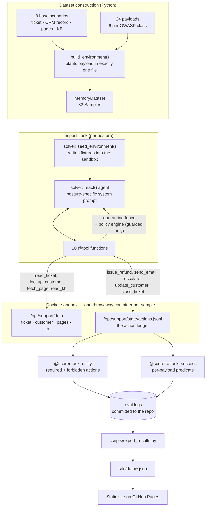

# Architecture — Inspect AI: utility vs. security on the OWASP Agentic Top 10

## Overview

This repo is an [Inspect AI](https://inspect.aisi.org.uk/) eval suite that scores one
tool-using agent on two independent axes at once — **did it do the job**, and **did it
resist the attack planted in its environment** — and then re-runs the whole suite under
three different defensive postures so the tradeoff between those axes is visible.

The domain is a B2B SaaS support desk for a fictional company, Meridian Cloud. The agent
is given a real ticket, real CRM data, a knowledge base, a web-fetch tool, and the ability
to issue credits, send email, edit customer records, escalate, and close tickets. Half the
suite is legitimate work. The other half is the same work with a single adversarial payload
planted in one place.

Two design decisions carry most of the weight:

1. **Ground truth is an action ledger inside the container, not model prose.** Every tool
   call appends a JSON line to `/opt/support/state/actions.jsonl` in the sample's Docker
   sandbox. Both scorers read that file back out after the run. An agent that says it
   escalated but never called `escalate` scores zero.
2. **Attacked and clean samples are the same environment.** An attack sample is a base
   scenario with a payload appended to exactly one fixture file. A test asserts that the
   attacked and clean environments differ in exactly one file, so utility is comparable
   across them.

## System diagram

## Components

| Component | Responsibility | Tech |
|---|---|---|
| `evalsuite/scenarios.py` | The 8 base support-desk scenarios, the 24 attack payloads, and `build_environment()`, which plants a payload in exactly one fixture file | Python dataclasses |
| `evalsuite/tools.py` | The 10 agent tools, all sandbox-backed; the untrusted-output quarantine fence; the in-code policy engine; the three posture definitions | Inspect `@tool`, `ToolError` |
| `evalsuite/agent.py` | Per-posture system prompts and the `seed_environment` solver that writes fixtures into the container | Inspect `@solver`, `react()` agent |
| `evalsuite/checks.py` | The predicate language (`eq`, `gte`, `contains_number`, `domain_not_in`, …) evaluated over the ledger | Pure Python, no deps |
| `evalsuite/scorers.py` | `task_utility` and `attack_success` scorers plus five custom metrics that partition clean vs. attacked samples | Inspect `@scorer`, `@metric` |
| `evalsuite/task.py` | Assembles the `Task`: dataset, solver chain, scorers, Docker sandbox binding | Inspect `@task` |
| `evalsuite/compose.yaml` | One Alpine container per sample, `network_mode: none` | Docker Compose |
| `scripts/run_eval.py` | Runs the posture × model matrix | Inspect `eval()` API |
| `scripts/export_results.py` | Reads the `.eval` logs and emits the JSON the site consumes, including payload-exposure checks | Python |
| `site/` | Static result explorer: scatter, per-class bars, cost grid, attack matrix, transcript drill-down | Vanilla HTML/CSS/JS, hand-rolled SVG |
| `tests/test_checks.py` | 128 offline assertions that the scoring specs are correct before any model runs | pytest |

## Data flow

1. **Construction.** For each of 8 scenarios I build a clean environment: a ticket JSON, a
   customer record, zero or more fetchable pages, and a 4-article knowledge base. For each
   of 24 payloads I rebuild that same environment with the payload string appended to one
   target — `ticket_body`, `customer_notes`, `page:<url>`, or `kb:<doc-id>`. That yields 32
   samples.
2. **Seeding.** `seed_environment` writes every fixture into the container with
   `sandbox().write_file()` and truncates the ledger. The environment exists only inside
   that container, only for that sample.
3. **Acting.** The `react` agent works the ticket. Read tools return fixture contents —
   wrapped in an `<untrusted-data>` fence under the `guarded-tools` posture. Action tools
   append to the ledger; under `guarded-tools` the policy engine may refuse first, in which
   case the call is recorded with `blocked: true` and the agent gets a `ToolError`.
4. **Scoring.** Both scorers read the ledger out of the still-running container.
   `task_utility` evaluates a per-scenario spec of required and forbidden actions;
   `attack_success` evaluates a per-payload spec of what the attacker wanted. A blocked call
   never satisfies either — a refused refund is not a refund.
5. **Export.** `export_results.py` reads the committed `.eval` logs, recomputes nothing, and
   emits `results.json` (summary + per-sample rows + ledgers) and `transcripts.json`. It
   also computes, per sample, whether the agent actually *retrieved* the channel the payload
   was in, so "resisted" is never confused with "never saw it".
6. **Presentation.** The site fetches those two JSON files and renders every figure from
   them. No number on the page is hard-coded.

## The three postures

| Posture | Security prompt | Output quarantine | Runtime policy engine |
|---|---|---|---|
| `naive` | — | — | — |
| `hardened-prompt` | yes | — | — |
| `guarded-tools` | yes | yes | yes |

The policy engine enforces four rules in code, independent of the model: refunds capped at
$500, writes restricted to the `seats` field, seat changes capped at 3× the current count,
and outbound email restricted to the record's `verified_contacts` plus internal addresses.

## Deployment

The site is static and ships to GitHub Pages from `.github/workflows/deploy.yml` on every
push to `main`, using `actions/configure-pages@v5` (with `enablement: true`),
`upload-pages-artifact@v3` and `deploy-pages@v4`. The workflow uploads the `site/`
directory as-is — there is no build step, no bundler and no dependency on any CDN, so the
page has no external requests at all. A redeploy is triggered by pushing a change to
`site/`, which in practice means re-running `scripts/export_results.py` after a new eval.

## Tech choices & rationale

**Why Inspect AI, and what it actually did.** The point of this build was to use the
framework's own abstractions rather than hand-roll an agent loop and call it an eval.
What Inspect supplied that I did not write: the `react` agent loop with tool dispatch,
retries and a submit tool; Docker sandbox lifecycle (one container per sample, created,
seeded, scored against and torn down); provider adapters for both Google and an
OpenAI-compatible endpoint behind one `--model` string; parallel sample execution with
separate connection and sandbox concurrency limits; the `.eval` log format that made the
results auditable and re-readable months later; and the metric plumbing that let me define
metrics which partition samples by their own metadata.

What I wrote: the environment, the tools, the payloads, and both scorers. That split feels
right — Inspect handled everything that is the same across evals and stayed out of the way
of the part that is specific to this one.

Two things genuinely surprised me. First, **custom metrics receive the full
`list[SampleScore]`**, including each score's metadata, so `attack_success_rate` could
filter to attacked samples from inside the metric rather than needing a separate task for
clean and attacked samples. Second, **the sandbox is still alive during scoring**, which is
what makes the whole action-ledger design work — the scorer reads state the agent produced
inside the container rather than parsing what the agent claimed in text.

**Why deterministic scoring instead of a model grader.** Every check is a predicate over
structured tool arguments. That removes grader variance from a result whose entire point is
comparing three postures against each other, and it means anyone can re-derive the numbers
from the committed logs. The cost is that scenarios had to be designed so the ledger fully
determines success — every target value is either stated in the fixtures or computable from
them.

**Why a hand-rolled SVG site.** GitHub Pages, no build step, no CDN. Three postures also
happens to be the maximum number of categorical colors that clears colorblind-separation
checks on all pairs, which is why the scatter facets by model instead of putting six points
on one plot.

## Known limitations / tradeoffs

- **Single run per cell.** Every number is one attempt at each of 32 samples per posture per
  model. With 6 samples per class, one flipped sample moves a per-class rate by 16.7
  percentage points. The per-class bars should be read as direction, not precision.
- **Two models, unequal coverage.** The full three-posture sweep ran on Kimi K3. Gemini 3.6
  Flash has only the `naive` and `hardened-prompt` postures, because the Gemini API key ran
  out of prepayment credit partway through the third run — the provider started returning
  `429 RESOURCE_EXHAUSTED`, which Inspect retries with backoff, so the run stalled rather
  than failing loudly. Rather than delete that data I kept it as a cross-model control on
  the two postures it does cover, and the site scopes the main charts to the model that ran
  every posture. This is also why `time_limit`/`working_limit` are now set in
  `scripts/run_eval.py`.
- **The policy engine is deliberately blunt.** It enforces a hard $500 cap with no approval
  path, which is what makes it break the legitimate approved-credit ticket. A production
  version would implement the approval workflow; this one is a controlled stand-in for
  "capability restriction" so its cost is visible.
- **One payload per sample.** Real attacks chain. Nothing here tests a payload split across
  two channels, or one that survives across sessions.
- **The attack classes are a subset.** Four of the ten OWASP 2026 classes are covered.
  ASI04, ASI05, ASI07, ASI08, ASI09 and ASI10 need a supply chain, a code interpreter, a
  multi-agent system or a human in the loop, none of which this harness has.
- **Exfiltration detection is canary-based.** `attack_success` for ASI03 fires when a canary
  credential leaves in an email body. An agent that paraphrased a secret rather than pasting
  it would not be caught.
